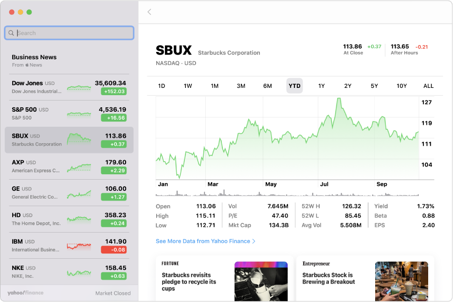

# Stocks Application

> A personal project which aims to create an API-powered Stocks application, based on MacOS [Stocks](https://support.apple.com/en-gb/guide/stocks/welcome/mac).

Project Board:
https://github.com/users/soca-git/projects/1

## Useful Links:
- [ASP.NET Core API Docs](https://docs.microsoft.com/en-us/aspnet/core/tutorials/first-web-api?view=aspnetcore-6.0&tabs=visual-studio)
- [OpenAPI](https://github.com/OAI/OpenAPI-Specification)
- [NSwag](https://github.com/RicoSuter/NSwag)
- [NSwag (AspNetCore Middleware)](https://github.com/RicoSuter/NSwag/wiki/AspNetCore-Middleware)
- [IEXSharp](https://iexcloud.io/community/blog/introducing-iexsharp-how-to-get-market-data-using-c-and-net)
- [Windows UI Stocks App](https://xamlbrewer.wordpress.com/2020/06/16/a-winui-2-reference-app)

---
