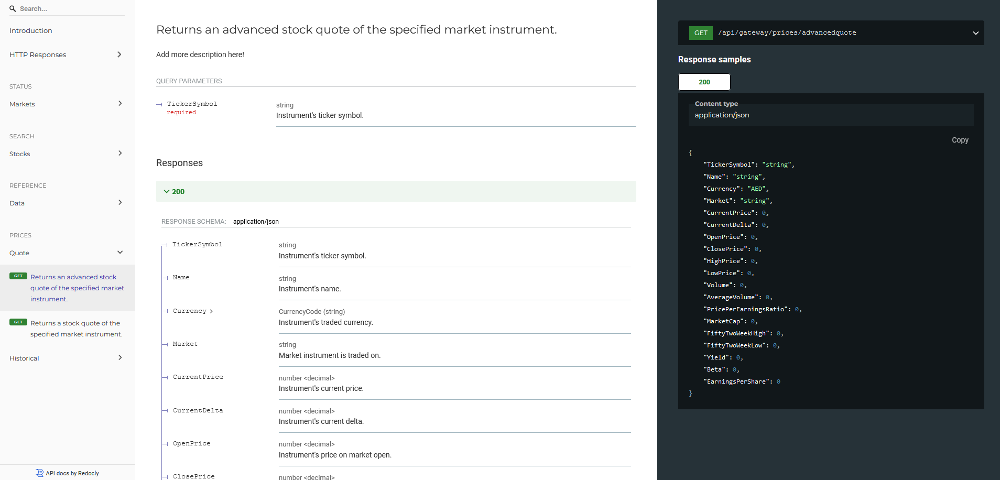

# Stocks Application


> A personal project which aims to create an API-powered Stocks application, based on MacOS [Stocks](https://support.apple.com/en-gb/guide/stocks/welcome/mac).  
> App is deployed @ https://stocks-api-app.herokuapp.com/redoc -> note that if the Heroku server is asleep, it may take some time to load. I automatically ping the servers frequently to try and prevent them from falling asleep! I have a work-around in the pipeline to keep them awake 24/7.
> 
> This project is continuously being updated; progress is tracked [here](https://github.com/users/soca-git/projects/1/views/1).

## Links
- [ASP.NET Core API Docs](https://docs.microsoft.com/en-us/aspnet/core/tutorials/first-web-api?view=aspnetcore-6.0&tabs=visual-studio)
- [OpenAPI](https://github.com/OAI/OpenAPI-Specification)
- [NSwag](https://github.com/RicoSuter/NSwag)
- [NSwag (AspNetCore Middleware)](https://github.com/RicoSuter/NSwag/wiki/AspNetCore-Middleware)
- [Redocly](https://github.com/Redocly/redoc)
- [IEXSharp](https://iexcloud.io/community/blog/introducing-iexsharp-how-to-get-market-data-using-c-and-net)
- [xUnit](https://xunit.net/#documentation)
- [Moq](https://github.com/moq/moq4)
- [PostmanAPI](https://www.postman.com/)
- [Docker](https://docs.docker.com/get-started/)
- [Heroku](https://devcenter.heroku.com/categories/deploying-with-docker)

## Stocks-API


## IEX Cloud Local Setup
Local usage of this API's financial data endpoints requires an IEXCloud account. A free trial account can be setup easily.  
Set the public & secret keys inside environment variables as follows.  

#### Windows 11:
> - Open the start menu.
> - Type ```edit ENV``` into the search bar and hit ```enter```.
> - Add ```IEX_PK``` and ```IEX_SK``` as user or system variables with their respective values from your IEXCloud account.

## Docker & Heroku Deployment
The application is deployed via a Docker container to Heroku. The [Dockerfile](./Dockerfile) is generated through Visual Studio Container Tools (```Right-Click Host Project``` > ```Add``` > ```Docker Support```).

---
